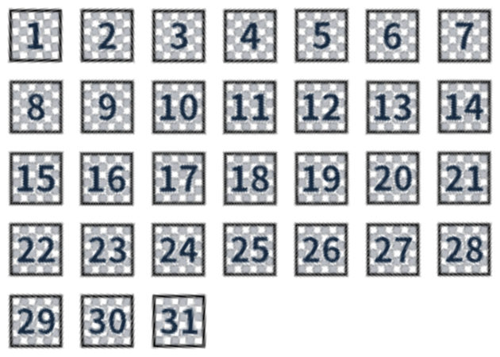

# RBMP — 回転境界マスクパッキング

**Rotational Bounding-Box Mask Packing** は、公式ScratchのBounding box bugと回転を使い、1枚のSVGから選択した画像だけをペンでスタンプする実験です。著者：**nakakoutv**。

[公開Scratchプロジェクト](https://scratch.mit.edu/projects/1387642307/) · [論文PDF（v1.1・8ページ）](成果物/論文/RBMP_回転境界マスクパッキング_nakakoutv.pdf)

## デモ

- [31文字の順次表示](成果物/SVG文字パッキング31文字_16x8.sb3)：1秒ごとに1文字ずつ繰り返します。
- [31文字＋31画像の2スプライトデモ](成果物/SVGパッキング31文字と31画像_スライダーデモ.sb3)：左は文字の順次表示、右は黒枠・白灰の市松模様・番号付き画像を変数スライダーで選択します。

画像ID、位置補正、方向、サイズ、コスチュームをScratchのリストに格納し、共通ブロック `画像を描画 (画像ID) x (x) y (y)` で参照します。スタンプ直前に「もし〈端に触れた〉なら」を空のまま実行します。



| パラメーター | 公開デモ |
|---|---:|
| SVG基準寸法 | 16 × 8 |
| 内部テクスチャ寸法（検証環境） | 2048 × 1024 px |
| 各画像の最大辺／SVG座標単位 | 0.22 |
| 各画像の最大辺／内部テクスチャ | 28.16 px |
| 1 SVG当たりの画像数 | 31 |
| 文字の最大表示辺 | 33 ステージ単位 |
| 番号付き画像の表示辺 | 66 ステージ単位 |
| 字形 | Noto Sans JP：文字400、数字700 |

31は検証した条件での個数であり、一般的な最大値の証明ではありません。寸法・テクスチャ倍率・字形の占有域・回転角・配置・余白・凸包用マーカーで個数が変わります。Scratchの不具合に依存するため、将来の修正で動作が変わる可能性があります。

## 再生成・検証

Python 3.12、Node.js 24で作業しました。一般的なPython／Node.js環境でも、次の依存関係を導入して実行できます。

```sh
python -m pip install -r requirements.txt
npm install
npx playwright install chromium
python setup_dependencies.py
python 生成/export_open_font.py
python 生成/build_dense_experiment.py --optimized
python 生成/build_two_sprite_demo.py
node 検証/verify-list-data.cjs
node 検証/verify-optimized.cjs
node 検証/verify-unmasked.cjs
python 検証/inspect_optimized.py
node 検証/verify-two-sprite.cjs
python 検証/inspect_numbered_tiles.py
node 検証/render-atlas-overview.cjs
```

既存Chromeを使う場合は環境変数 `CHROME_PATH` にChrome実行ファイルを指定できます。検証は公式scratch-vm／scratch-renderをブラウザーで実行し、全31件、リスト参照、スライダー、時間切り替え、孤立画像とのピクセル比較を確認します。Scratchウェブサイト全体の自動テストではありません。

`生成/` はパラメーター探索と生成、`検証/` は実行・画像比較、`素材/` はSVGとデータ、`検証結果/` は数値と確認画像、`資料/` は検討記録です。`dependencies.json` にScratch依存関係の固定バージョンとハッシュがあります。

論文生成コードも `生成/build_rbmp_paper.py` に収録しています。上記の検証とアトラス画像生成を済ませた後に実行すると、OFL版の図を使う別名のPDFを出力します。保管された原版v1.1のPDFは上書きしません。本文フォントは `export_open_font.py` が生成する静的なNoto Sans JPを使います。

## 公開範囲と論文との違い

論文v1.1は当初の実験記録を保持しています。GitHub用デモは字形素材をNoto Sans JP（OFL）に差し替え、参考サンプルに依存しない新規プロジェクトから生成しています。配置・マスク・リスト参照の方式は同じですが、字形と見た目は公開Scratch版／論文の実験画像と異なります。

過去の数学的な探索結果は収録しています。公開用デモの実行結果は再検証で更新し、従来の字形に対する検証結果は `検証結果/履歴/` に分離しています。原本のWindowsフォント・字形素材、権利が未確認の参考サンプル、個人環境のパス、キャッシュ、第三者ライブラリの配布物は公開対象から除きました。

フォント由来の素材には [OFLライセンス](フォント/OFL.txt) が適用されます。その他の第三者情報と作者物の権利は [THIRD_PARTY_NOTICES.md](THIRD_PARTY_NOTICES.md) を参照してください。
